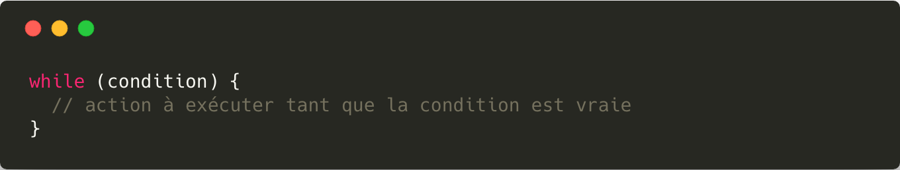
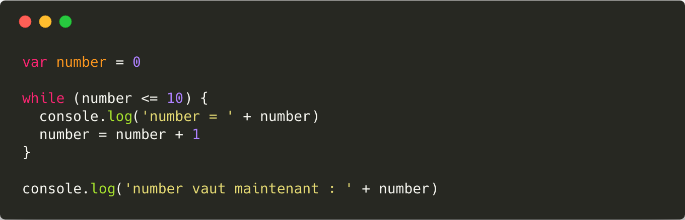
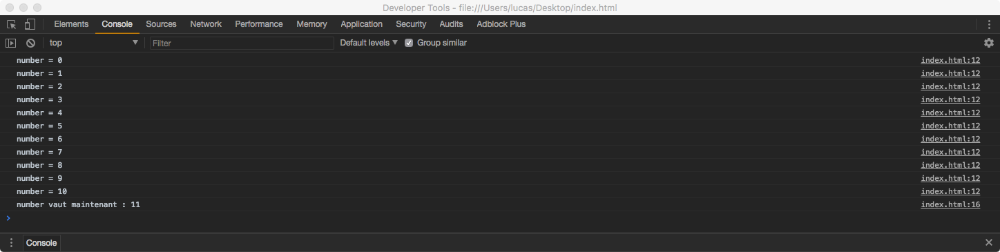
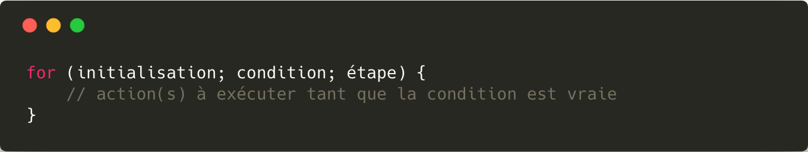
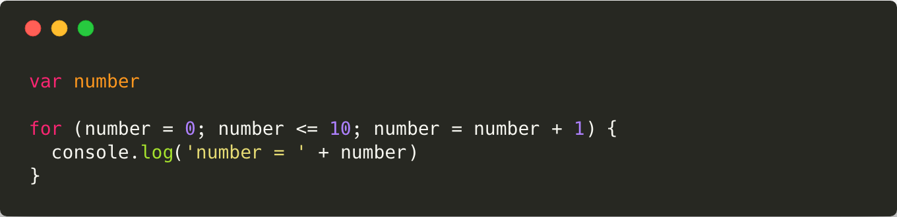
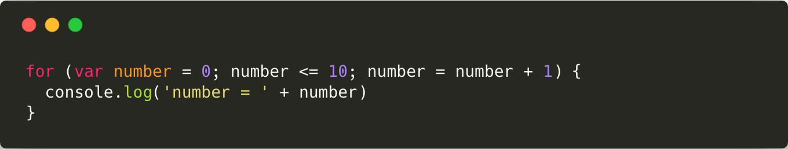
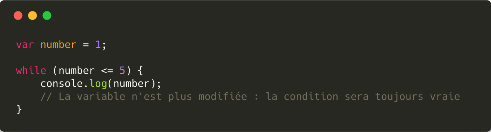
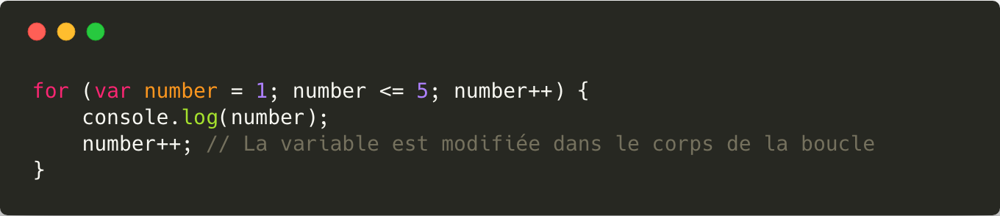

# Les boucles

Les boucles permettent de répéter des instructions **tant qu'[une condition](./Les_conditions.md) est vérifiée**.

## La boucle `while`

La boucle `while` est la première syntaxe de boucle à connaître.

### Syntaxe

### Exemple

**Résultat**

> Le bloc d'instructions associé à une boucle est appelé le **corps de la boucle**.

## La boucle `for`

On a fréquemment besoin d'écrire des boucles dont la condition est basée sur la valeur d'une variable qui est modifiée dans le corps de la boucle. Pour répondre à ce besoin on dispose d'un autre type de boucle : le `for`.

### Syntaxe

### Exemple

Son fonctionnement est un peu plus complexe que celui d'un `while` :

* L'**initialisation** se produit une seule fois, au début de l'exécution.
* La **condition** est *évaluée* avant chaque tour de boucle. Si elle est vraie, un nouveau tour de boucle est effectué. Sinon, la boucle est terminée.
* L'**étape** est réalisée après chaque tour de boucle.

> La variable utilisée dans l'initialisation, la condition et l'étape d'une boucle `for` est appelée **le compteur** de la boucle.

> Le compteur est souvent nommé `i` ou `cpt` par convention.

Très souvent, on n'a pas besoin d'utiliser la variable compteur en dehors du corps de la boucle. Dans ce cas, on peut la *déclarer* en même temps qu'on **l'initialise** dans la boucle.

## Erreurs fréquentes

### Boucle infinie

On appelle boucle infinie, une boucle dont la condition est indéfiniment vraie.

**Exemple**

### Modifier le compteur d'une boucle `for`

L'incrémentation du compteur d'une boucle `for` est faite à chaque tour de boucle **automatique** grace à la déclaration de l'*étape* lors de la déclaration du `for`.

> Dans l'exemple précédent, le compteur est donc incrémenté à deux reprises.