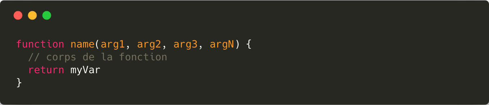
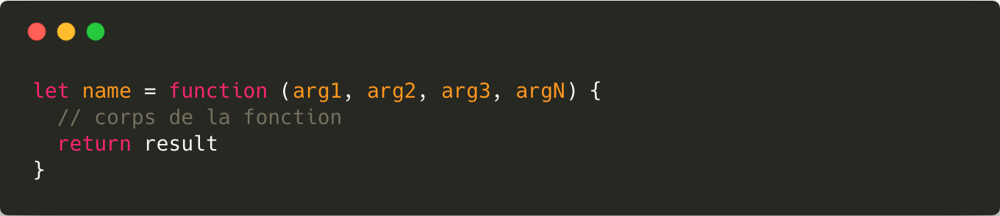
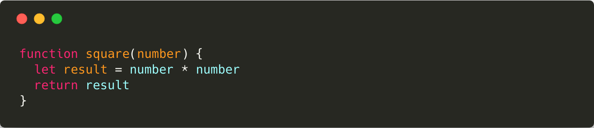
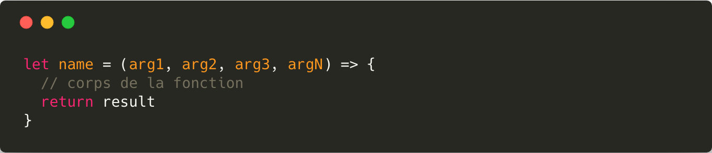
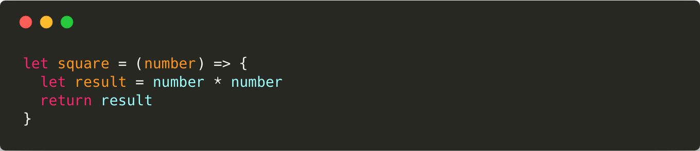
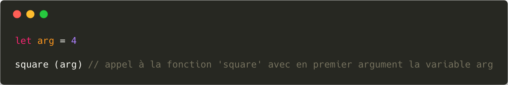
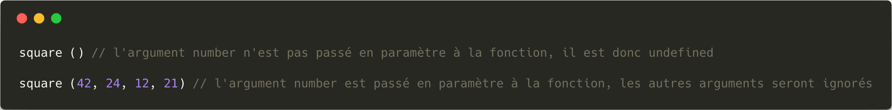
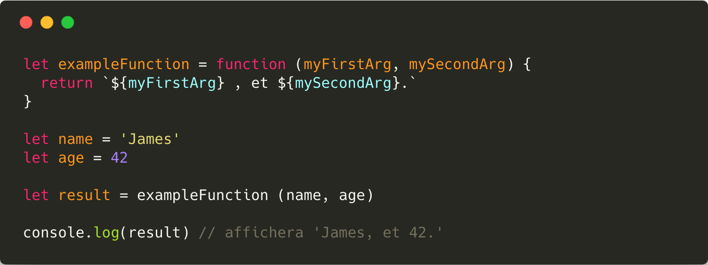
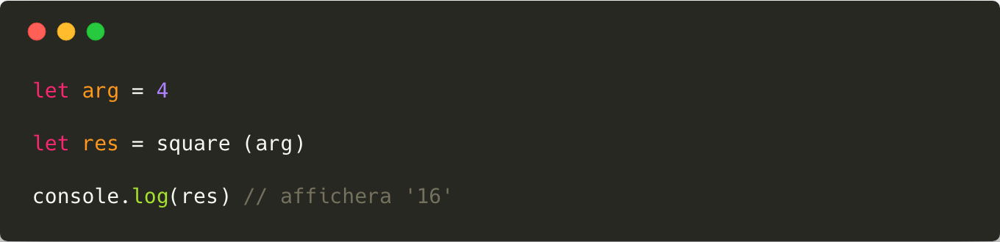

# Les fonctions

Une **fonction** est un regroupement d'instructions qui réalise une tâche donnée.

## Déclarer une fonction

### Syntaxe

Il existe deux syntaxes différentes pour définir une fonction.

**Définition par `déclaration`**

**Définition par `expression`**

> Les deux syntaxes, bien que différentes, produisent le même résultat : la définition d'une fonction.

### Lexique

* Le mot-clé `function` permet de créer une nouvelle fonction, il est indispensable et obligatoire.
* Un fonction à toujours **un nom en anglais** et en **[camelCase](https://eslint.org/docs/rules/camelcase)**
* Le nom des **arguments** de la fonction sont **en anglais et en camelCase**. Ils permettent de passer des variables à une fonction.
* Le mot-clé `return` permet à la fonction de retourner une valeur.

> Les différents arguments d'une fonction ne sont pas obligatoires, une fonction peut ne prendre aucun argument lors son appel.

### Exemple

> La fonction `square` est une fonction qui permet d'élever un nombre au carré.
Elle prend un nombre en argument et retourne le carré de ce nombre.

## Les fonction fléchées

Les fonctions fléchées sont des fonctions qui ont une syntaxe particulière et qui ont été introduite avec l'**ES6**.

### Syntaxe

La syntaxe des fonctions fléchée est presque identique à celle des fonctions *normales*, on a cependant remplacé le mot-clé `function` par une flèche `=>` en fin de déclaration.

### Exemple

## Appeler une fonction

Pour utiliser une fonction, on a besoin de l'**appeler**. Pour appeler une fonction, il faut spécifier le nom de celle-ci et passer **entre parenthèses** les différents arguments dont elle a besoin.

> La fonction `square` requiert un seul et unique argument : le nombre à élever au carré.

### Les arguments

Si une fonction requiert un argument il est indispensable de lui fournir cet argument lors de l'appel à la fonction. Cependant si on fournit plus d'arguments que nécessaire la fonction les ignorera.

> Le nom des arguments sont propres à la fonction, il n'est pas nécessaire de passer en argument une variable du même nom que l'argument.

### Le retour d'une fonction

Dans le cas d'une fonction qui retourne une valeur, à l'aide du mot-clé `return`, il est possible de récupérer cette valeur et la stocker dans une variable.

