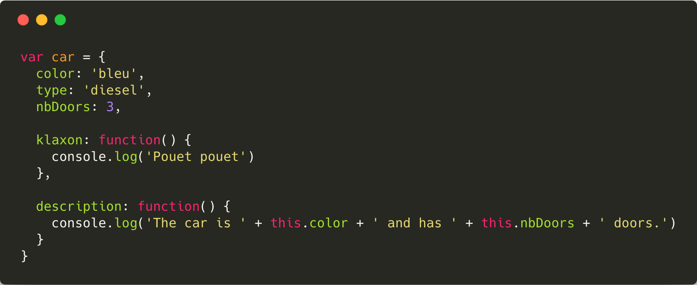
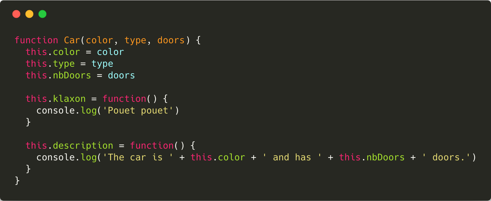
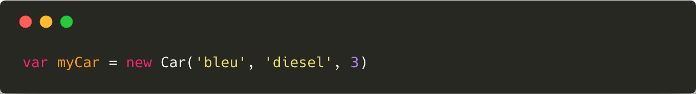
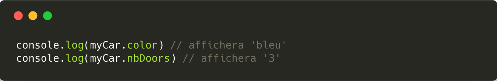
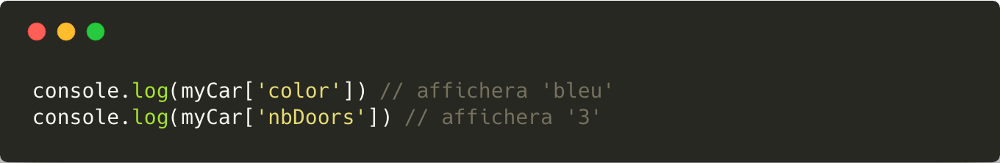
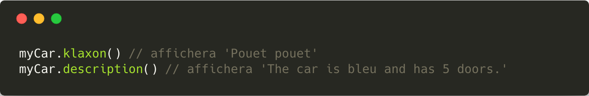
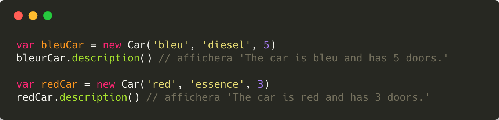
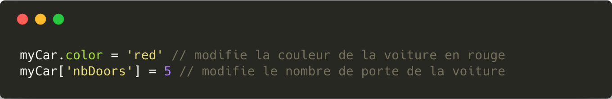
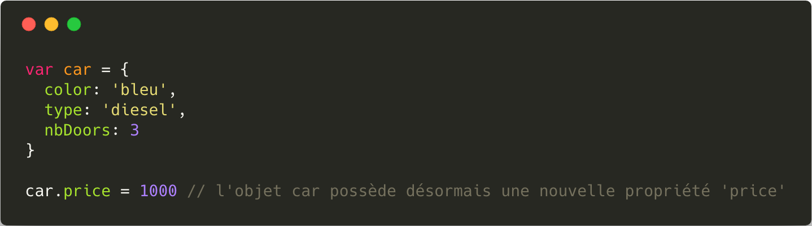

# Les Objets

**Un objet** est [une variable](./Les_Variables.md) qui permet de regrouper une seule entité possédant plusieurs propriétés. Contrairement à une variable classique qui ne contient qu'une seule donnée, un objet, peut, quant à lui, contenir différents types de données appelées **propriété**.

## Lexique

* On appelle `propriété` d'un objet, une caractéristique de celui-ci.
* On appelle `méthode` d'un objet, [une fonction](./Les_fonctions.md) associé à l'objet.
* Le mot clé `this` correspond à l'instance actuelle de l'objet que l'on manipule.
* Le `constructor`d'un objet est la fonction qui permet de créer une nouvelle instance de l'objet.

## Création d'un objet

Il existe plusieurs façons différentes de créer un objet.

### Création littéral

Pour créer un objet de manière littéral en JavaScript il faut définir les différentes propriétés et méthode de celui-ci a l'intérieur d'accolades : `{....}`

La variable `car` est donc une variable de type objet qui possède plusieurs propriétés : `color`, `type` et `nbDoors`.
>Chaque propriété possède un nom et une valeur, et est séparée des autres par une virgule `,` (sauf la dernière).

### Utilisation d'un constructeur

Une autre possibilité pour créer des objets consiste à utiliser un `constructor`. Un `constructor` est [une fonction](./Les_fonctions.md) particulière dont le rôle est d'initialiser un nouvel objet.

>Le constructeur d'un objet commence toujours par une majuscule.

Afin de créer un nouvel objet à partir de son constructeur, il faut utiliser le mot-clé `new‌`.

## Utilisation d'un objet

### Propriétés

Pour accéder à la valeur d'une propriété d'un objet il faut utiliser la *notation pointée* `monObjet.maPropriété`.

>On utilise un point `.` entre le nom de l'objet et sa propriété pour pouvoir accéder à sa valeur.

Il existe également une seconde syntaxe pour accéder aux propriété d'un objet, semblable à celle [des tableaux](./Les_tableaux.md) : `monObjet['maPropriété']`.

### Méthodes 

Pour accéder à une méthode d'un objet il faut utiliser la *notation pointée* `monObjet.maMéthode()`.

### Le mot-clé `this`

Le mot-clé `this` est défini automatiquement par JavaScript à l'intérieur d'une méthode et représente **l'objet sur lequel la méthode a été appelée**.

Ainsi lors de l'appel à la méthode `description()`, le mot-clé `this` représentera l'objet `Car` qui aura appelé la méthode.

## Modification d'un objet

Une fois l'objet créé il est tout à fait possible de modifier les valeurs de ses propriétés.

Il est également possible d'ajouter dynamiquement de nouvelles propriétés à un objet *déjà créé*.

