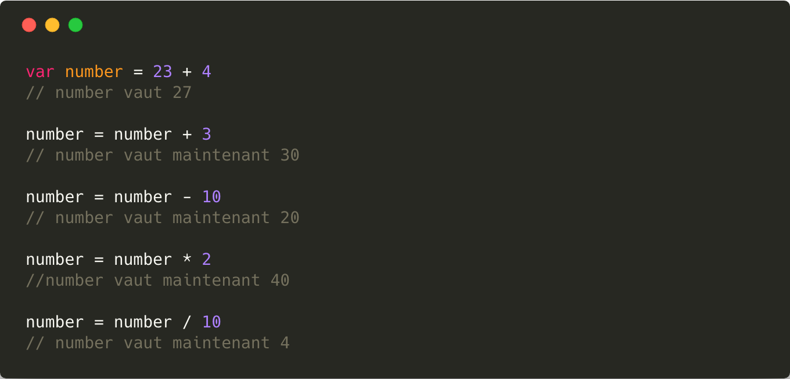
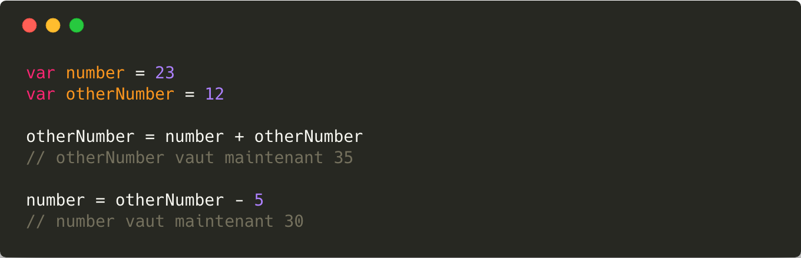
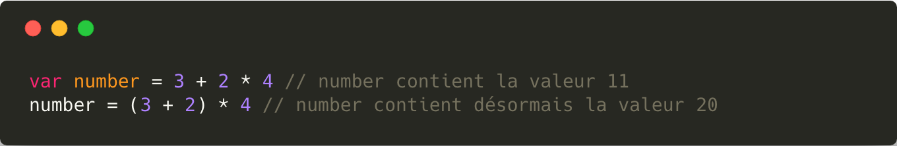
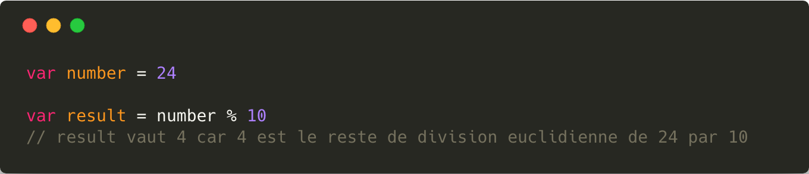
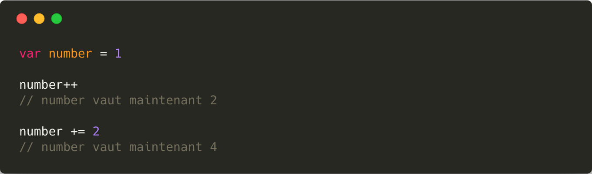
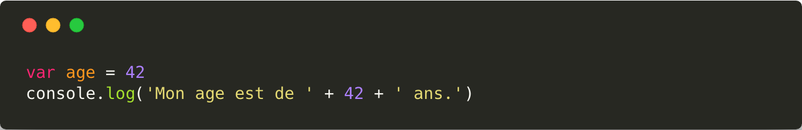
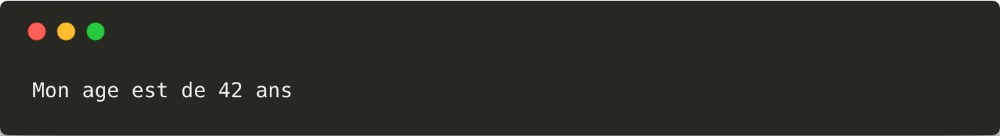
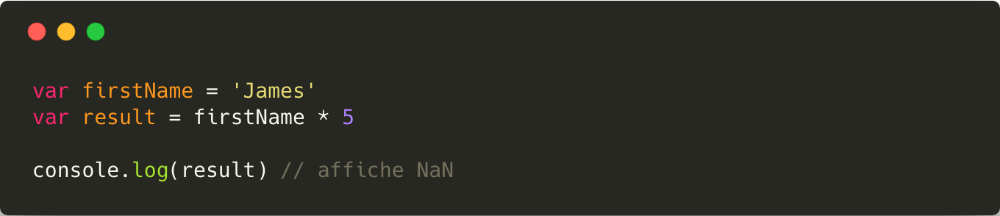
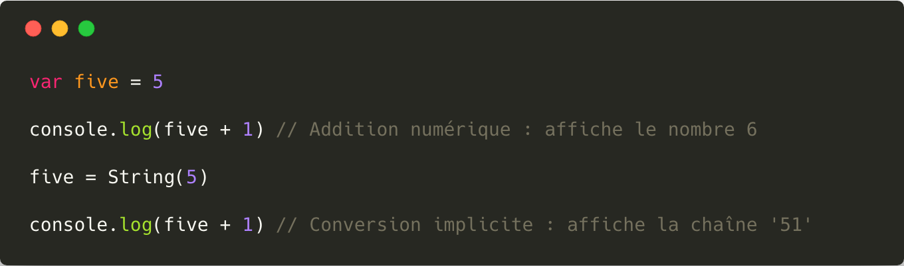
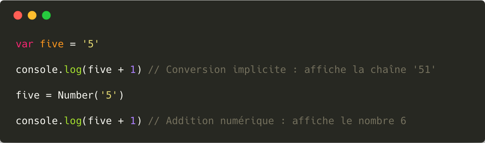

# Les opérations sur les variables

Il est possible d'effectuer diverses opérations sur une ou plusieurs [variables](./Les_Variables.md).

## Opérations mathématiques

Comme en mathématique, il est possible d'effectuer des additions, soustraction, division et multiplication sur les [variables](./Les_Variables.md).

### Opérations basique

Il possible de manipuler les variables via les différents opérateurs mathématiques pour en modifier leurs valeurs.

Il est possible d'effectuer des opérations sur les variables entres-elles.

Comme en mathématique il est possible d'utiliser les parenthèses pour modifier l'ordre de priorité des opérations.

### Modulo

Le `modulo` est une opération mathématique qui permet d'obtenir le reste de la division euclidienne.

### Incrémentation

On appelle `incrémentation` le fait d'ajouter une valeur fixe à une variable.
> Il existe plusieurs manières d'incrémenter une variable.
> 
> L'opérateur `++` ajoute 1 à la variable tandis que l'opérateur `+=` permet d'ajouter une valeur choisie

###

> À l'inverse, on appelle `décrémentation` l'action de soustraire une valeur fixe à une variable.
> 
> On utilisera pour cela l'opérateur logique `myVar--` ou `myVar -= 1`.

## Conversions de types

Bien qu'en JavaScript on indique pas le type d'une variable lors de sa déclaration, il reste toutefois possible de modifier celui-ci au cours d'un programme.

### Conversions implicite

Certaines conversions sont dites implicites : elles sont faites **automatiquement** par l'ordinateur.

**Résultat :**

### Conversions explicite

Bien que le JavaScript soit extrêmement tolérant avec les conversions de types, il arrive parfois qu'une conversion de soit pas possible.

>En cas d'échec de conversion d'un nombre, la valeur du résultat est `NaN` (Not A Number).

Dans ce cas il va falloir **expliciter** la conversion. C'est à dire qu'il faudra dire au programme comment on souhaite convertir une donnée.

**Conversion vers une chaîne de caractères :**

Pour convertir explicitement une valeur en [une chaîne de caractères](./Les_chaines_de_characteres.md), il faut utiliser l'instruction `String(expression)` :

**Conversion vers un nombre :**

Pour convertir explicitement une valeur en un nombre, il faut utiliser l'instruction `Number(expression)` :

