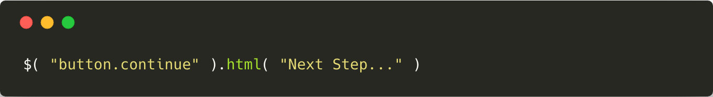
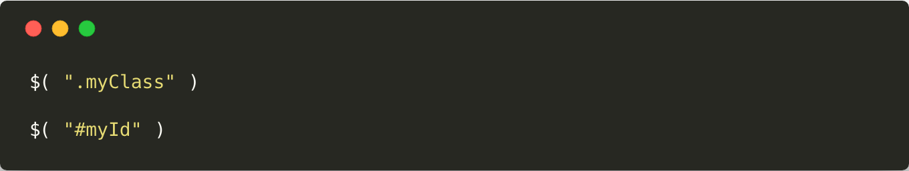
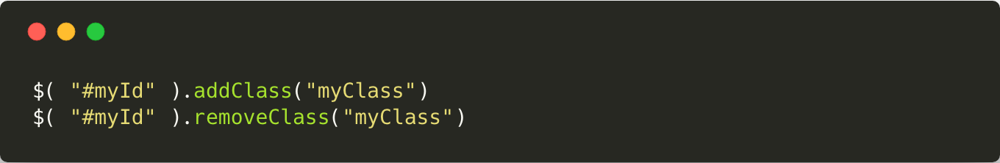
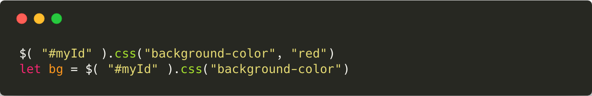
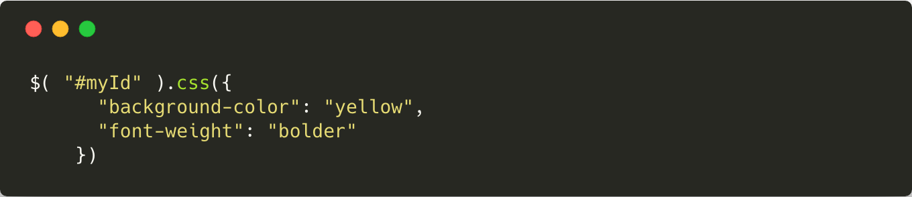
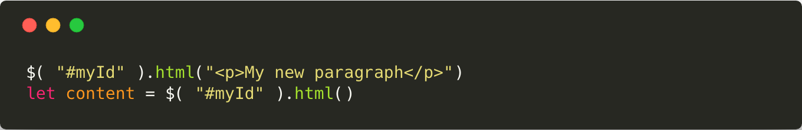
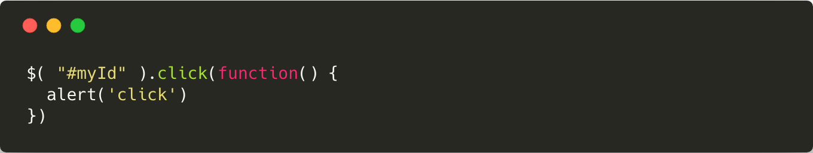

# JQuery

JQuery est une librairie JavaScript qui permet d'interagir, de manipuler et d'animer le DOM (HTML/CSS) de manière très simple.

## Installer JQuery

### Téléchargement en local

Pour télécharger le fichier `jquery.js` c'est [ici](http://jquery.com/download/).

### CDN

CDN pour JQuery par Google
```
<script src="https://ajax.googleapis.com/ajax/libs/jquery/3.3.1/jquery.min.js"></script>
```

## Utiliser JQuery

L'utilisation de JQuery est très simple, elle s'effectue dans un script JavaScript (fichier `.js` ou entre des balises `<script></script>`).

JQuery introduit une nouvelle variable globale qui se nomme `$` et qui correspond à JQuery. Ainsi pour utiliser JQuery on peut écrire du code comme suit :



JQuery permet de manière très simple d'interagir avec les différents éléments de la page, de modifier le contenu de la page à la volée, mais aussi de créer des animations en JavaScript.

## Fonctions utiles

### ID/Class Selector

JQuery permet de sélectionner des éléments grâce à leurs `class` ou à leur `id` de la même manière que les sélecteurs CSS.



### `.addClass()` / `.removeClass()`

Les fonctions `.addClass()` et `.removeClass()` permettent, comme leurs noms l'indiquent, d'ajouter ou de supprimer une classe CSS, préalablement existante, à un élément du DOM.



### `.css()`

La fonction `.css()` permet de récupérer la valeur d'une propriété CSS d'un élément ou de la modifier.



> Dans un premier temps, on attribue la valeur `red` à la propriété `background-color` de notre élément, dans un second temps, on récupère sa valeur qu'on stocke dans la variable `bg`.

Pour modifier plusieurs propriétés CSS d'un même élément, il faut utiliser un [objet](../../md/basics/Les_objets.md) JavaScript.



> Ici on modifie les propriétés `background-color` et `font-weight` de l'élément.

### `.html()`

La fonction `.html()`, à l'instar de la fonction `.css()`, permet de récupérer ou de modifier le contenu HTML d'un élément.



### `.click()`

La fonction `.click()` permet d'exécuter du code lors du clique sur l'élément HTML.


